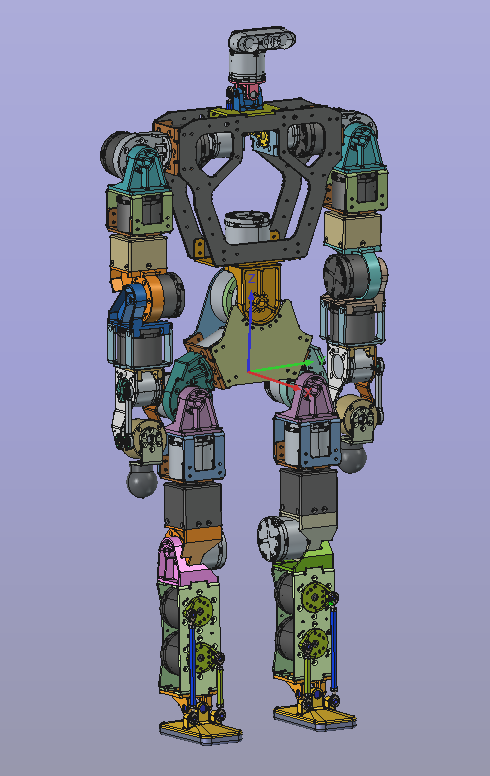

# Sprite Humanoid FreeCAD

FreeCAD source files for the Sprite humanoid hardware structure.

The files in this repository are released as hardware design source under the
CERN Open Hardware Licence Version 2 - Strongly Reciprocal
(`CERN-OHL-S-2.0`). This is a strong reciprocal open hardware license intended
for design materials and physical products derived from them.

Source location:

https://github.com/BeijingDynamics/sprite_humanoid_freecad

## Contents

- `00-SPRITE.FCStd`: top-level Sprite assembly.
- `01-*`, `02-*`, `03-*`, `04-*`, `05-*`: subsystem, link, joint, motor,
  bearing, and fastener FreeCAD source files.

## License Notice

Copyright (C) 2026 BeijingDynamics.

These hardware design source files are licensed under the CERN Open Hardware
Licence Version 2 - Strongly Reciprocal. See `LICENSE` for the full license
text.

The design files and any products made from them are provided without warranty.
Verify dimensions, materials, fasteners, loads, clearances, manufacturing
tolerances, motor ratings, wiring, safety limits, and assembly procedures
before fabrication or use.
